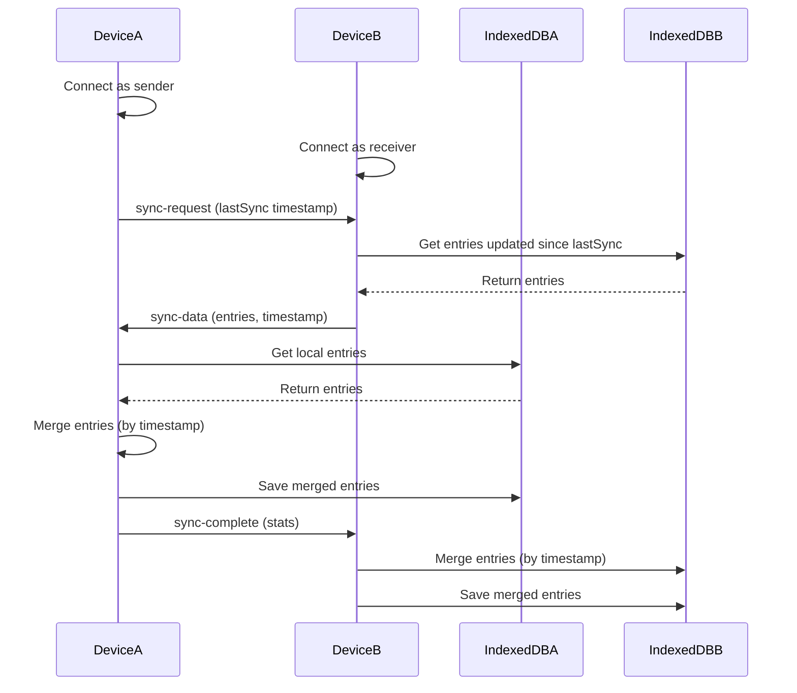

# English Learning App - Implementation Plan

## Overview

Build a browser-based English learning app with vocabulary tracking, translation, AI-powered learning features, and P2P sync between devices. All data is stored locally in the browser.

## Core Features

### 1. Vocabulary Management System

- Add words/phrases with translations
- Store pronunciation (IPA, audio)
- Add example sentences
- Tag words by category/topic
- Add notes/context
- Track word difficulty level

### 2. Translation & Dictionary Integration

- Google Translate API integration
- Dictionary lookup (word definitions, synonyms, antonyms)
- Pronunciation playback (Text-to-Speech)
- Support for multiple language pairs

### 3. Learning & Testing Features

#### 3.1 Spaced Repetition System (SRS)

- SM-2 algorithm implementation
- Review scheduling based on word difficulty
- Daily review queue
- Streak tracking

#### 3.2 Quiz Modes

- Flashcard mode (flip to reveal)
- Multiple choice
- Fill-in-the-blank
- Typing practice (spell the word)
- Listening comprehension (audio to text)

#### 3.3 Progress Tracking

- Words learned count
- Review streaks
- Accuracy statistics
- Learning time tracking

### 4. AI-Powered Features (OpenAI-compatible API)

#### 4.1 Example Sentences

- Generate context-aware example sentences
- Sentences at different difficulty levels

#### 4.2 Grammar & Usage Explanations

- Explain word usage in different contexts
- Compare similar words (when to use which)
- Grammar tips for target language

#### 4.3 Conversation Practice

- AI chat partner for language practice
- Conversation scenarios
- Feedback on responses

#### 4.4 Pronunciation Help

- Phonetic breakdown
- Similar sounding words comparison
- Common pronunciation mistakes

### 5. Data Management

#### 5.1 Local Storage (IndexedDB)

- Vocabulary entries
- Learning progress
- Quiz history
- Settings/preferences

#### 5.2 P2P Sync (WebRTC)

- Bidirectional sync between devices
- Independent record comparison (merge by timestamp)
- Conflict resolution strategies
- Sync status indicators

#### 5.3 Export/Import

- Export data to JSON file
- Import from JSON file
- Clean import option (clear existing data)
- Backup/restore functionality

### 6. User Interface

#### 6.1 Main Pages

- Home/Dashboard (quick stats, daily review)
- Vocabulary List (browse, search, filter)
- Add/Edit Word
- Quiz/Practice
- AI Assistant
- Settings

#### 6.2 Responsive Design

- Mobile-first approach
- Touch-friendly controls
- Optimized for reading ebooks on desktop
- Optimized for audio practice on mobile

## Technical Architecture

### Data Models

```typescript
// Vocabulary Entry
interface VocabularyEntry {
  id: string
  word: string
  translation: string
  pronunciation?: string // IPA notation
  audioUrl?: string // TTS audio
  partOfSpeech?: string
  definitions: string[]
  exampleSentences: string[]
  tags: string[]
  notes?: string
  difficulty: 1 | 2 | 3 | 4 | 5
  createdAt: number
  updatedAt: number
  lastReviewedAt?: number
  srsData: {
    interval: number
    repetition: number
    efactor: number
    nextReview: number
  }
}

// Quiz Session
interface QuizSession {
  id: string
  type: 'flashcard' | 'multiple-choice' | 'fill-blank' | 'typing' | 'listening'
  words: string[] // word IDs
  results: {
    wordId: string
    correct: boolean
    attempts: number
    timeTaken: number
  }[]
  startedAt: number
  completedAt?: number
}

// Learning Stats
interface LearningStats {
  totalWords: number
  wordsLearned: number
  reviewsCompleted: number
  currentStreak: number
  longestStreak: number
  accuracy: number
  totalStudyTime: number
}

// Settings
interface AppSettings {
  sourceLanguage: string
  targetLanguage: string
  googleTranslateApiKey?: string
  llmApiUrl?: string
  llmApiKey?: string
  dailyReviewGoal: number
  srsSettings: {
    easyBonus: number
    intervalModifier: number
  }
}
```

### IndexedDB Schema

```bash
Database: LanguageTeacherDB
Version: 1

Object Stores:
- vocabulary (keyPath: id, indexes: word, tags, difficulty, nextReview)
- quizSessions (keyPath: id, indexes: type, startedAt)
- stats (keyPath: id, single record)
- settings (keyPath: id, single record)
```

### P2P Sync Protocol

```typescript
// Sync Message Types
type SyncMessage =
  | { type: 'sync-request'; lastSync: number }
  | { type: 'sync-data'; entries: VocabularyEntry[]; timestamp: number }
  | { type: 'sync-complete'; stats: SyncStats }
  | { type: 'sync-error'; error: string }

// Merge Strategy
function mergeEntries(local: VocabularyEntry[], remote: VocabularyEntry[]): VocabularyEntry[] {
  const merged = new Map<string, VocabularyEntry>()
  
  // Add all local entries
  local.forEach(entry => merged.set(entry.id, entry))
  
  // Merge remote entries
  remote.forEach(remoteEntry => {
    const localEntry = merged.get(remoteEntry.id)
    if (!localEntry) {
      // New entry from remote
      merged.set(remoteEntry.id, remoteEntry)
    } else if (remoteEntry.updatedAt > localEntry.updatedAt) {
      // Remote entry is newer
      merged.set(remoteEntry.id, { ...localEntry, ...remoteEntry })
    }
    // If local is newer, keep local
  })
  
  return Array.from(merged.values())
}
```

## Implementation Steps

### Phase 1: Foundation & Core Data Layer

1. Create new IndexedDB schema for language learning data
2. Implement vocabulary CRUD operations
3. Create data models and types
4. Set up basic UI layout with navigation

### Phase 2: Vocabulary Management

1. Build Add/Edit Word form
2. Implement Google Translate API integration
3. Add Text-to-Speech pronunciation
4. Create vocabulary list view with search/filter
5. Add tagging system

### Phase 3: Learning System

1. Implement Spaced Repetition (SM-2) algorithm
2. Build flashcard quiz mode
3. Build multiple choice quiz
4. Build fill-in-the-blank quiz
5. Build typing practice
6. Build listening comprehension
7. Create daily review dashboard

### Phase 4: AI Features

1. Implement OpenAI-compatible API client
2. Build example sentence generator
3. Build grammar/usage explainer
4. Build similar word comparison
5. Build conversation practice chat
6. Add pronunciation help features

### Phase 5: Data Sync & Export

1. Implement P2P sync for vocabulary data
2. Add sync status indicators
3. Build export to JSON functionality
4. Build import from JSON functionality
5. Add clean import option

### Phase 6: UI Polish & Testing

1. Responsive design improvements
2. Accessibility features
3. Performance optimization
4. Error handling and user feedback
5. Testing and bug fixes

## File Structure

```bash
app/
  [lang]/
    page.tsx                    # Dashboard (daily review, stats)
    vocabulary/
      page.tsx                  # Vocabulary list
      add/page.tsx              # Add new word
      [id]/page.tsx             # Edit/view word
    quiz/
      page.tsx                  # Quiz mode selection
      [type]/page.tsx           # Active quiz session
    ai/
      page.tsx                  # AI assistant
      chat/page.tsx             # Conversation practice
    settings/
      page.tsx                  # Settings page

lib/
  types.ts                      # Data models
  indexed-db.ts                 # IndexedDB operations (language learning)
  sync-manager.ts              # P2P sync logic
  srs-algorithm.ts             # Spaced repetition implementation
  google-translate.ts           # Google Translate API client
  llm-client.ts                # OpenAI-compatible API client
  tts-utils.ts                 # Text-to-speech utilities

services/
  vocabulary-service.ts         # Vocabulary CRUD
  quiz-service.ts              # Quiz logic
  stats-service.ts             # Statistics tracking
  ai-service.ts                # AI features

hooks/
  use-vocabulary.ts            # Vocabulary state management
  use-quiz.ts                  # Quiz state management
  use-srs.ts                   # SRS calculations
  use-sync.ts                  # P2P sync hook

components/
  vocabulary/
    word-card.tsx
    word-form.tsx
    word-list.tsx
  quiz/
    flashcard.tsx
    multiple-choice.tsx
    typing-input.tsx
  ai/
    chat-interface.tsx
    example-sentences.tsx
    word-comparison.tsx
  ui/                          # Existing UI components
```

## API Integration Notes

### Google Translate API

- Endpoint: `https://translation.googleapis.com/language/translate/v2`
- Required: API Key
- Features: Translation, Language detection

### OpenAI-compatible API

- User provides: Base URL and API Key
- Models: User can specify model name
- Features: Chat completions for all AI features

## P2P Sync Flow



## Key Design Decisions

1. **No Server Storage**: All data stays in browser for privacy
2. **Bidirectional Sync**: Both devices can initiate sync
3. **Timestamp-based Merge**: Newest record wins, no conflicts
4. **Modular AI**: AI features optional, work without API key
5. **Mobile-First**: Optimized for mobile audio practice, desktop reading
6. **Progressive Enhancement**: Core features work without AI

## Dependencies to Add

```json
{
  "dependencies": {
    "date-fns": "^3.0.0",           // Date formatting
    "react-confetti": "^6.0.0",     // Celebration effects
    "react-hot-toast": "^2.4.0"     // Toast notifications (or use existing sonner)
  }
}
```

## Notes

- Reuse existing P2P infrastructure (PeerJS, IndexedDB storage pattern)
- Leverage existing i18n system for multi-language support
- Keep existing UI components (Tailwind, Radix UI)
- Cloudflare Workers deployment maintained for P2P signaling
