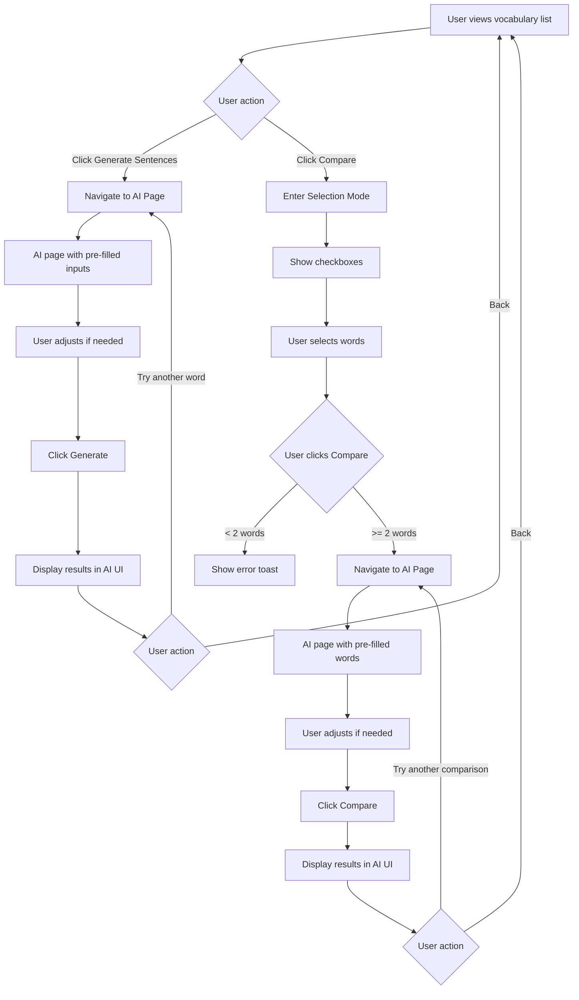

# Vocabulary List Shortcut Buttons Design

## Overview
Add shortcut buttons in the vocabulary list to help generate example sentences or compare two or more vocabulary words.

## Design Decision: Reuse Existing AI Assistant Page

The existing AI Assistant page ([`components/ai-client.tsx`](components/ai-client.tsx)) already has:
- **Example Sentences** feature with word/translation inputs
- **Compare Words** feature with multi-word selection
- Dedicated UI for displaying results

**Recommended Approach:** Add shortcut buttons that navigate to the AI Assistant page with pre-filled data, rather than creating new modals. This:
- Reuses existing, tested UI components
- Keeps AI features in one place
- Reduces code duplication
- Maintains consistent UX

## Current State Analysis

### Existing UI Structure
The vocabulary list displays entries in cards with:
- Word, pronunciation, difficulty badge
- Translation
- Tags
- Example sentence (if exists)
- Review info (due date)
- Action buttons: Google Translate, Edit, Delete

### Available AI APIs
1. **Generate Example Sentences** (`/api/ai/sentences`)
   - Input: word, translation, difficulty
   - Output: 3 example sentences with translations

2. **Compare Words** (`/api/ai/compare`)
   - Input: array of words (2+ required)
   - Output: differences, examples, recommendations

---

## Proposed UI Design

### Option 1: Navigate to AI Assistant Page (RECOMMENDED)

Add two new buttons that navigate to the AI Assistant page with pre-filled data:

**Generate Sentences Button:**
- Clicking navigates to `/{lang}/ai?feature=sentences&word={word}&translation={translation}`
- AI page automatically fills the word/translation inputs
- User can adjust difficulty and click "Generate Sentences"

**Compare Button:**
- Clicking activates selection mode with checkboxes
- After selecting 2+ words, user clicks "Compare Selected"
- Navigates to `/{lang}/ai?feature=compare&words={word1,word2,...}`
- AI page automatically adds the words to the compare list

**Benefits:**
- Reuses existing AI UI components
- No new modal components needed
- Consistent UX across the app
- User can adjust parameters before generating

**Visual Layout:**

```
┌─────────────────────────────────────────────────────────────┐
│  hello  /həˈloʊ/  🔊  [2]  [2x]                               │
│  你好                                                        │
│  [greeting] [common]                                         │
│  "Hello, how are you today?"                                 │
│  📅 Due for review                                           │
│                                                              │
│  [🌐] [✏️] [📝] [⚖️] [🗑️]                                   │
│     ^    ^    ^    ^    ^                                    │
│     |    |    |    |    |                                    │
│  Trans Edit Sent Comp Delete                                 │
│           ence pare                                           │
└─────────────────────────────────────────────────────────────┘
```

```
┌─────────────────────────────────────────────────────────────┐
│  [ ] hello  /həˈloʊ/  🔊  [2]  [2x]                          │
│      你好                                                     │
│      [greeting] [common]                                      │
│      "Hello, how are you today?"                             │
│      📅 Due for review                                       │
│                                                              │
│      [🌐] [✏️] [📝] [⚖️] [�️]                               │
│      Trans Edit Sent Comp Delete                             │
│            ence AI  AI                                        │
└─────────────────────────────────────────────────────────────┘
```

**Buttons:**
- 🌐 Google Translate (existing)
- ✏️ Edit (existing)
- 📝 Generate Sentences (NEW) - Book icon → navigates to AI page
- ⚖️ Compare (NEW) - GitCompare icon → enables selection mode
- 🗑️ Delete (existing)

**Icons to use:**
- Generate Sentences: `Book` or `Sparkles` from lucide-react
- Compare: `GitCompare` from lucide-react

---

### Option 2: Inline Modals (Alternative)

Add modals directly in the vocabulary list page instead of navigating to AI page:

**Generate Sentences Modal:**
- Opens inline when clicking the button
- Shows 3 generated sentences
- Options to save or copy

**Compare Modal:**
- Opens inline after selecting words
- Shows comparison results

**Trade-offs:**
- ✅ No page navigation needed
- ❌ Duplicates AI UI code
- ❌ Harder to maintain consistency

---

## Recommended Implementation: Navigate to AI Assistant

### Why This Approach?

1. **Reuses existing UI**: No need to duplicate modal components
2. **Consistent UX**: All AI features in one place
3. **Flexible**: User can adjust parameters before generating
4. **Maintainable**: Single source of truth for AI features

### User Flow

#### Generate Example Sentences (Single Word)
1. User clicks 📝 button on a vocabulary card
2. Navigate to AI Assistant page with URL params:
   - `?feature=sentences&word=hello&translation=你好&difficulty=2`
3. AI page auto-fills the word/translation inputs
4. User can adjust difficulty if needed
5. User clicks "Generate Sentences"
6. Results displayed in existing AI UI

#### Compare Words (Multiple Words)
1. User clicks ⚖️ button (Compare) on any card
2. Selection mode activates (checkboxes appear)
3. User selects 2+ words to compare
4. Bulk action bar appears at bottom
5. User clicks "Compare Selected"
6. Navigate to AI Assistant page with URL params:
   - `?feature=compare&words=hello,hi,hey`
7. AI page auto-adds the words to compare list
8. User can add more words or adjust
9. User clicks "Compare"
10. Results displayed in existing AI UI

---

## Component Changes Required

### 1. Vocabulary List Client (`components/vocabulary-list-client.tsx`)

**New State Variables:**
```typescript
const [selectionMode, setSelectionMode] = useState(false);
const [selectedIds, setSelectedIds] = useState<Set<string>>(new Set());
```

**New Functions:**
```typescript
// Toggle selection mode
const toggleSelectionMode = () => {
  setSelectionMode(!selectionMode);
  setSelectedIds(new Set());
};

// Toggle word selection
const toggleSelection = (id: string) => {
  setSelectedIds(prev => {
    const newSet = new Set(prev);
    if (newSet.has(id)) {
      newSet.delete(id);
    } else {
      newSet.add(id);
    }
    return newSet;
  });
};

// Generate example sentences - navigate to AI page
const handleGenerateSentences = (entry: VocabularyEntry) => {
  const params = new URLSearchParams({
    feature: 'sentences',
    word: entry.word,
    translation: entry.translation,
    difficulty: entry.difficulty.toString()
  });
  router.push(`/${lang}/ai?${params.toString()}`);
};

// Compare selected words - navigate to AI page
const handleCompareWords = () => {
  if (selectedIds.size < 2) {
    toast.error(t('vocabulary.selectAtLeastTwo'));
    return;
  }
  const selectedEntries = vocabulary.filter(v => selectedIds.has(v.id));
  const words = selectedEntries.map(v => v.word).join(',');
  const params = new URLSearchParams({
    feature: 'compare',
    words
  });
  router.push(`/${lang}/ai?${params.toString()}`);
};

// Select all visible words
const selectAllVisible = () => {
  const visibleIds = filteredVocabulary
    .slice((currentPage - 1) * ITEMS_PER_PAGE, currentPage * ITEMS_PER_PAGE)
    .map(v => v.id);
  setSelectedIds(new Set(visibleIds));
};
```

**UI Changes:**
1. Add checkbox to each card (visible only in selection mode)
2. Add 📝 Generate Sentences button to action section
3. Add ⚖️ Compare button to action section
4. Add bulk action bar (visible when selection mode active)

### 2. AI Client (`components/ai-client.tsx`)

**New: Parse URL Parameters on Mount**

```typescript
import { useSearchParams } from 'next/navigation';

export function AIClient({ lang }: AIClientProps) {
  const searchParams = useSearchParams();
  const t = useMemo(() => getTranslations(lang), [lang]);

  // Parse URL params on mount
  useEffect(() => {
    const feature = searchParams.get('feature');
    
    if (feature === 'sentences') {
      setActiveFeature('sentences');
      setWordInput(searchParams.get('word') || '');
      setTranslationInput(searchParams.get('translation') || '');
    } else if (feature === 'compare') {
      setActiveFeature('compare');
      const words = searchParams.get('words');
      if (words) {
        setCompareWords(words.split(','));
      }
    }
  }, [searchParams]);
```

### 3. Localization Updates

Add to `locales/en/common.json` and `locales/zh/common.json`:

```json
{
  "vocabulary": {
    "generateSentences": "Generate Sentences",
    "compareWords": "Compare Words",
    "selectToCompare": "Select words to compare",
    "selectedCount": "{{count}} selected",
    "selectAtLeastTwo": "Select at least 2 words to compare",
    "selectAll": "Select All",
    "compareSelected": "Compare Selected ({{count}})",
    "cancelSelection": "Cancel"
  }
}
```

---

## Visual Design Specifications

### Button Styling
```tsx
// Generate Sentences Button - navigates to AI page
<button
  onClick={() => handleGenerateSentences(entry)}
  className="p-2 text-gray-600 hover:text-blue-600 hover:bg-blue-50 rounded-lg transition-colors"
  title={t('vocabulary.generateSentences')}
>
  <Book className="w-4 h-4 sm:w-5 sm:h-5" />
</button>

// Compare Button - toggles selection mode
<button
  onClick={toggleSelectionMode}
  className={`p-2 rounded-lg transition-colors ${
    selectionMode
      ? 'text-green-600 bg-green-50'
      : 'text-gray-600 hover:text-green-600 hover:bg-green-50'
  }`}
  title={t('vocabulary.compareWords')}
>
  <GitCompare className="w-4 h-4 sm:w-5 sm:h-5" />
</button>

// Checkbox (visible only in selection mode)
{selectionMode && (
  <input
    type="checkbox"
    checked={selectedIds.has(entry.id)}
    onChange={() => toggleSelection(entry.id)}
    className="w-5 h-5 rounded border-gray-300 text-blue-600 focus:ring-blue-500"
  />
)}
```

### Bulk Action Bar
```tsx
{selectionMode && (
  <div className="fixed bottom-0 left-0 right-0 bg-white border-t border-gray-200 shadow-lg p-4 z-50">
    <div className="max-w-7xl mx-auto flex flex-col sm:flex-row items-center justify-between gap-3">
      <div className="flex items-center space-x-4">
        <span className="font-medium text-gray-900">
          {t('vocabulary.selectedCount', { count: selectedIds.size })}
        </span>
        <button
          onClick={selectAllVisible}
          className="text-blue-600 hover:text-blue-700 text-sm"
        >
          {t('vocabulary.selectAll')}
        </button>
      </div>
      <div className="flex items-center space-x-2 w-full sm:w-auto">
        <button
          onClick={handleCompareWords}
          disabled={selectedIds.size < 2}
          className="flex-1 sm:flex-none bg-green-600 text-white px-4 py-2 rounded-lg font-medium hover:bg-green-700 disabled:opacity-50 disabled:cursor-not-allowed flex items-center justify-center space-x-2"
        >
          <GitCompare className="w-4 h-4" />
          <span>{t('vocabulary.compareSelected', { count: selectedIds.size })}</span>
        </button>
        <button
          onClick={toggleSelectionMode}
          className="px-4 py-2 rounded-lg text-gray-600 hover:bg-gray-100"
        >
          {t('vocabulary.cancelSelection')}
        </button>
      </div>
    </div>
  </div>
)}
```

---

## Mermaid Diagram: User Flow



---

## Mobile Considerations

### Responsive Design
- On mobile, buttons should remain the same size (4x4 icons)
- Bulk action bar should be full-width with stacked buttons
- AI page is already responsive

### Touch Targets
- Minimum 44x44px for all buttons
- Add padding around buttons for better touch accuracy

---

## Accessibility

### Keyboard Navigation
- All buttons should be focusable
- Use `aria-label` for icon-only buttons
- Selection mode should work with keyboard

### Screen Reader Support
- Announce selection mode activation
- Announce number of selected items
- Use proper ARIA labels for navigation

---

## Future Enhancements

1. **Batch Generate Sentences**: Generate sentences for multiple selected words at once
2. **Quick Actions Menu**: Add a dropdown menu with more AI options (pronunciation, grammar, etc.)
3. **Save to Quiz**: Add generated sentences directly to quiz questions
4. **Export Comparison**: Export comparison results as PDF or text
5. **History**: Keep track of generated sentences/comparisons
6. **Keyboard Shortcuts**: Add keyboard shortcuts for quick access

---

## Summary

The **Navigate to AI Assistant** approach is recommended because it:
- Reuses existing, tested AI UI components
- Keeps all AI features in one place
- Reduces code duplication and maintenance burden
- Provides consistent UX across the app
- Allows users to adjust parameters before generating
- Works well on both desktop and mobile
- Leverages existing AI APIs without major changes
